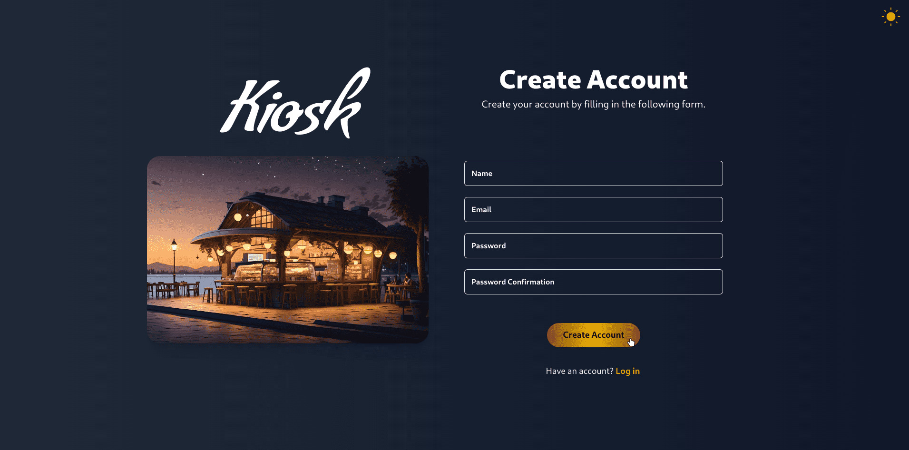

# Kiosk

Kiosk application developed using React and Laravel frameworks along with MySQL as DB, this project utilizes APIs to facilitate seamless communication between the two platforms. Approach that leverages the robust capabilities of Laravel, particularly in terms of server-side logic and data management, while also benefiting from React's strengths in creating interactive and user-friendly interfaces.


*Create new account with dark mode activated.*


*Log in to an existing account with dark mode activated.*


*Validation example when creating an account.*


*Product Modal Info with quantity selector.*


*Adding a new product to the order.*


*Order, Menu and categories view with dark mode selected.*


*Admin Panel - Check for order details and mark "complete order" button functionality.*


*Admin Panel - Check every product registered in the DB and mark as "out of stock" an specific product.*


*Kiosk tablet view with dark mode selected.*

## Installation

* **Create a new connection and a new database (using the database tool of your preference).**

* **Clone the repository.**

```bash
git clone https://github.com/AdolfoPastelin/Kiosk.git
```

* **Navigate to the project directory and install the dependencies.**

```bash
cd project_directory_path/
```

*For Laravel:*

```bash
composer install
```

*For React:*

```bash
npm install
```

* **Generate your own application key.**

```bash
php artisan key:generate
```

* **Create a `.env` file and fill it with your environment's details similar to the following example.**

```bash
# .env file

APP_NAME=Laravel
APP_ENV=local
APP_KEY=YOUR_APP_KEY # (generated in the previous step)
APP_DEBUG=true
APP_URL=http://localhost

LOG_CHANNEL=stack
LOG_DEPRECATIONS_CHANNEL=null
LOG_LEVEL=debug

DB_CONNECTION=mysql
DB_HOST=127.0.0.1
DB_PORT=3306
DB_DATABASE=YOUR_DB_NAME # Could be Kiosk or any other name of your choice
DB_USERNAME=YOUR_DB_USERNAME
DB_PASSWORD=YOUR_DB_PASSWORD

# Allow port 3307 when port 3306 is already in use
FORWARD_DB_PORT=3307
```

* **Run the migrations.**

```bash
php artisan migrate
```

* **(Optional) Seed the database with some data.**

```bash
php artisan db:seed
```

* **Start the laravel server.**

```bash
php artisan serve
```

* **In a new terminal window, navigate to the React app directory and start the React server.**

```bash
npm run dev
```
